# Ecommerce Chatbot - Mermaid Diagrams

## 1. System Architecture Diagram

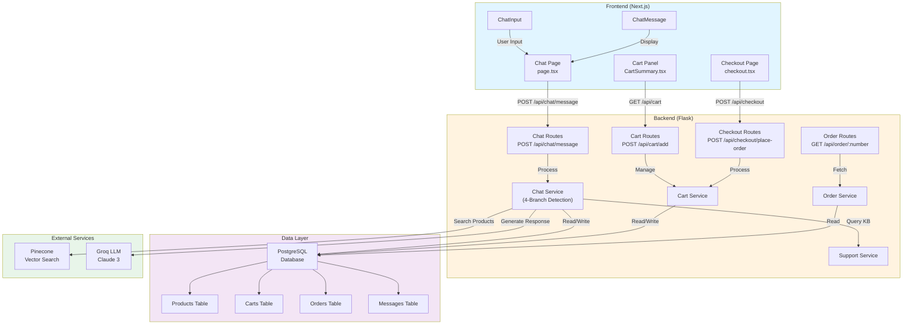

---

## 2. Chat Service - 4-Branch Intent Detection

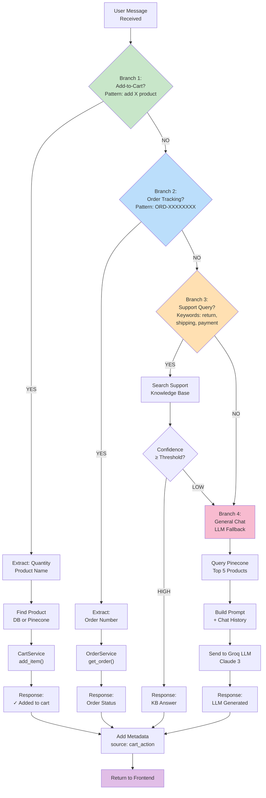

---

## 3. Add-to-Cart Flow (Detailed)

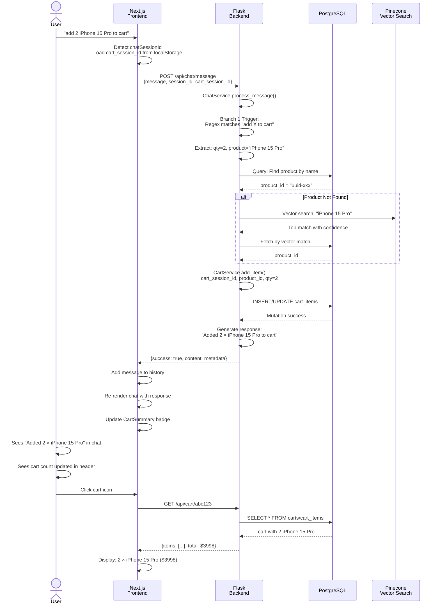

---

## 4. Checkout Workflow

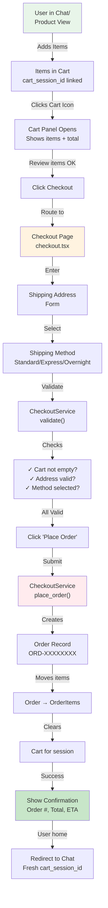

---

## 5. Database Schema Relationships

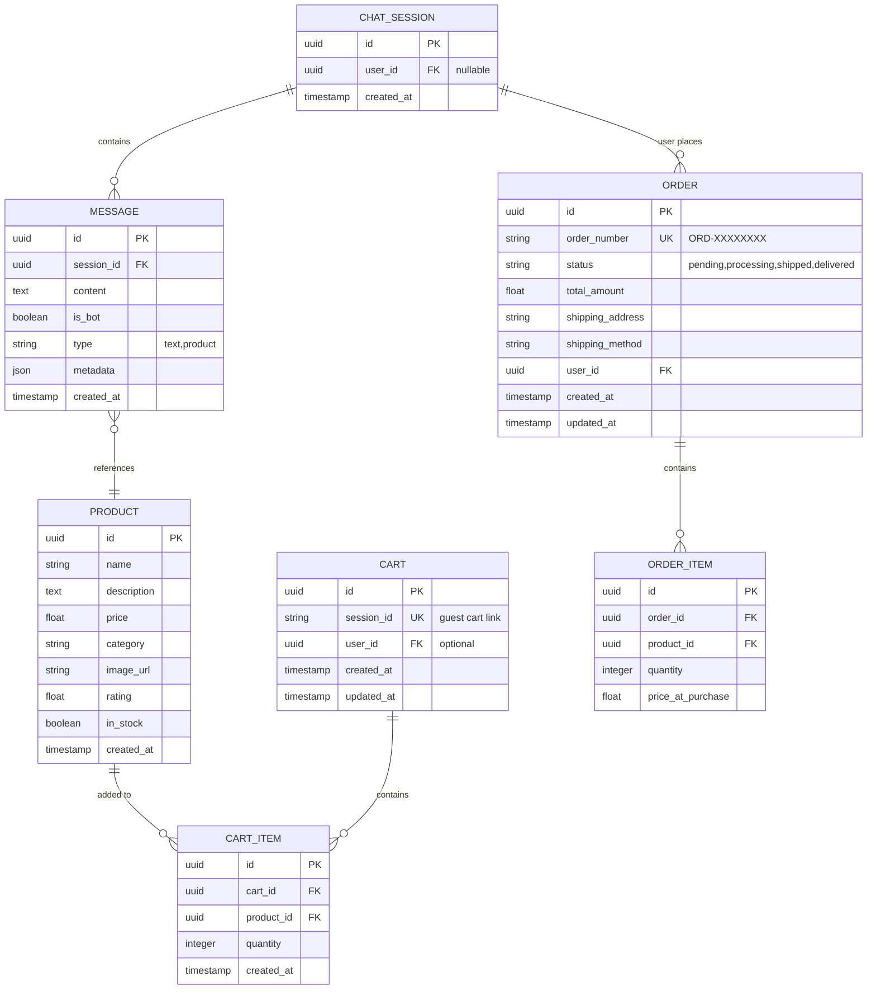

---

## 6. API Request/Response Flow

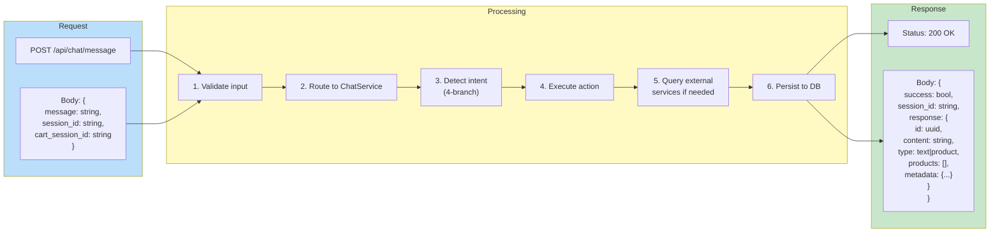

---

## 7. User Journey: From Chat to Order

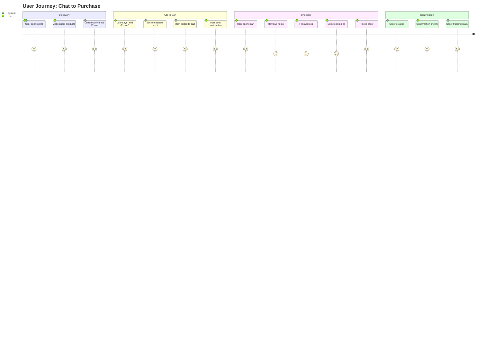

---

## 8. Docker Compose Services

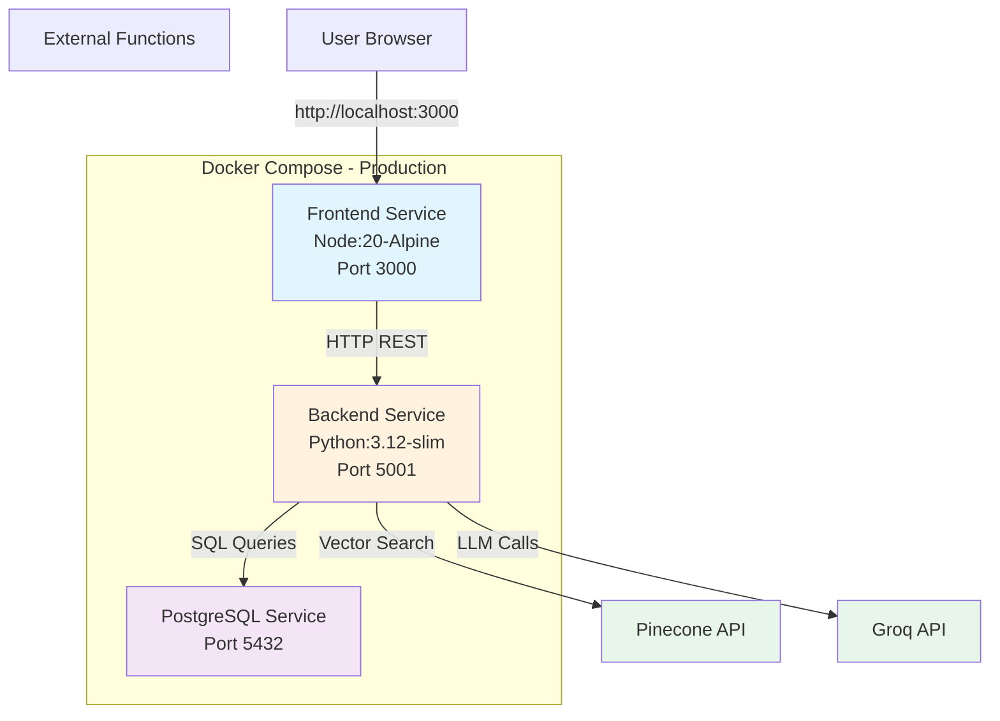

---

## 9. Order Status State Machine

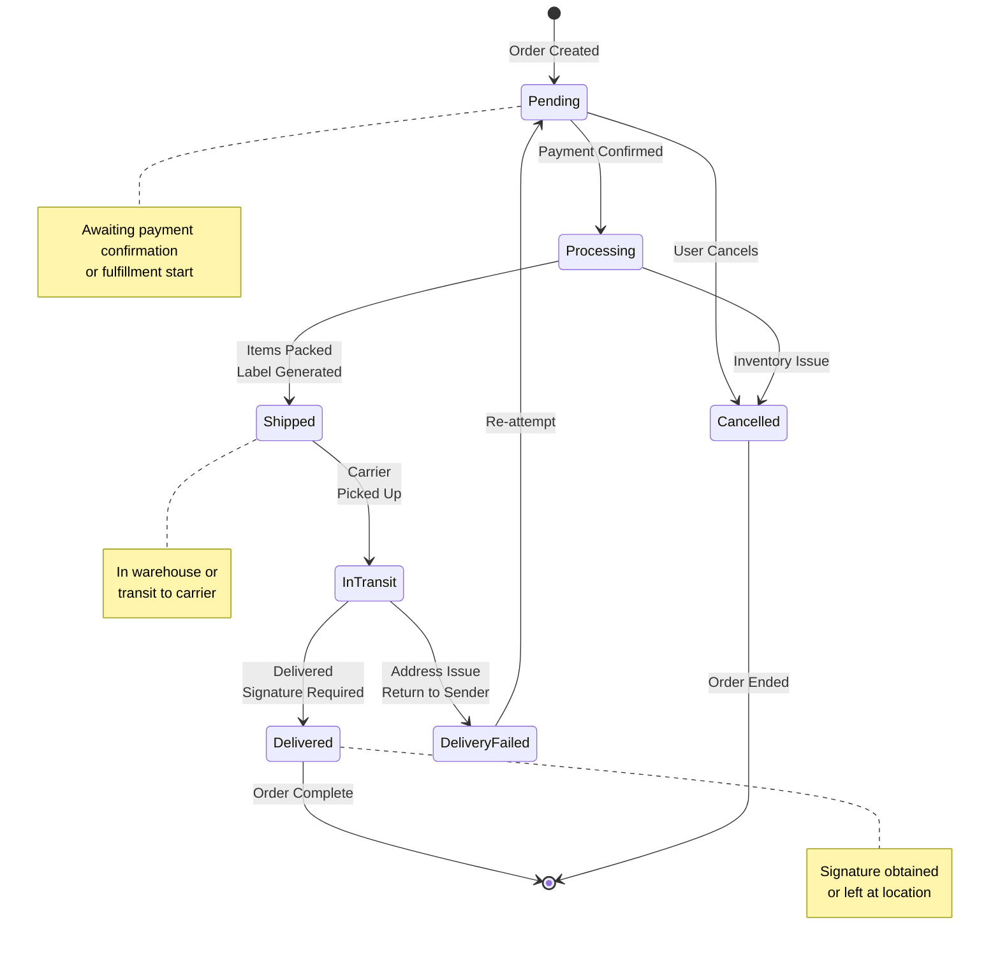

---

## 10. Integration Test Layers

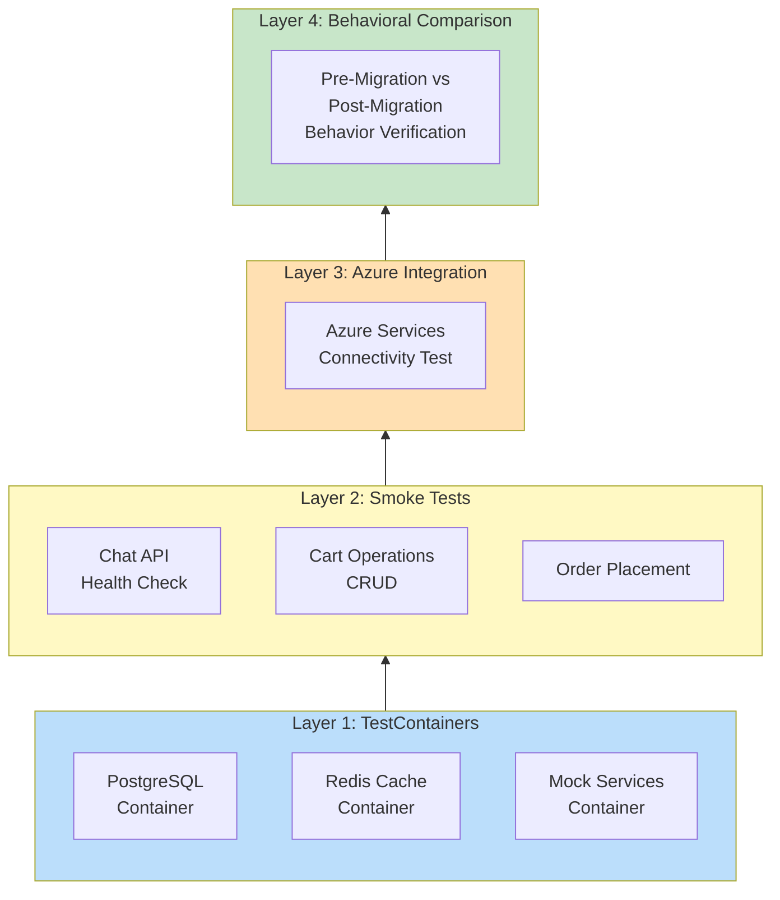

---

## 11. Feature flags & A/B Testing

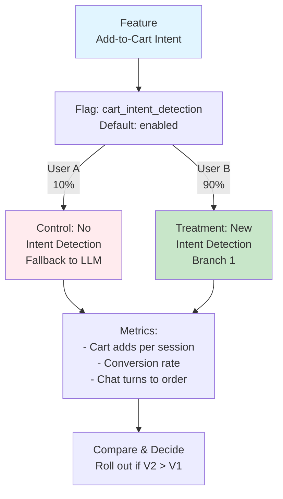

---

## 12. Message Flow with Session Linking

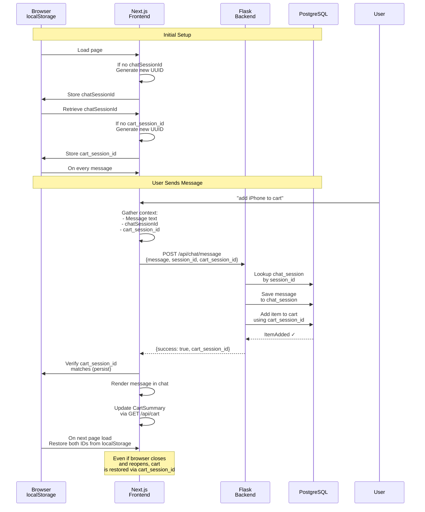

---

## How to Use These Diagrams

### Option 1: Copy to Markdown
Paste any diagram code block into a `.md` file and render using:
- GitHub (native Mermaid support)
- GitLab
- Confluence
- Notion

### Option 2: Online Editor
Paste code into: https://mermaid.live

### Option 3: VS Code Extension
Install "Markdown Preview Mermaid Support" extension

### Option 4: Generate PNG/SVG
```bash
npm install -g mermaid-cli
mmdc -i diagram.mmd -o diagram.png
```

---

**Created:** April 18, 2026
